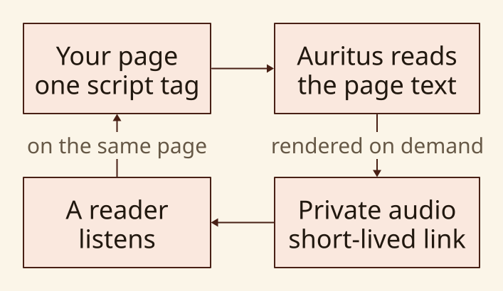
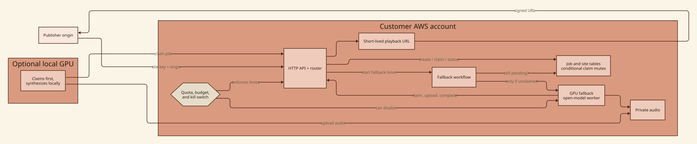

# Auritus

Open-source (MIT) drop-in web embed that just-in-time generates TTS audio of a
page's content. You choose the open model, its parameters, and where synthesis
runs: a GPU you control first, with AWS GPU capacity available as a dependable
fallback.

**Site:** [aurit.us](https://aurit.us)

## What it does

1. A generator module walks the host page DOM, applies ignore rules, and builds
   a TTS input string plus a stable content hash.
2. A player module requests (or waits for) audio for that hash and plays it.
3. A cloud backend (CDK) stores jobs behind a DynamoDB mutex. A local GPU
   worker can claim jobs; if none claims within a configurable timeout
   (default 15 minutes), Step Functions submits an AWS Batch GPU job.
4. Pluggable TTS backends: Kokoro (default speech) and Qwen 3 CustomVoice.
   Higgs remains a 440 Hz tone stub, not a speech demo.

## How it works



Auritus is designed for teams that want the convenience of embedded narration
without handing their page content and model choices to a TTS vendor. The
browser sends only the content it needs to narrate to infrastructure you
operate. A local worker can remove cloud GPU cost for ordinary work; AWS Batch
keeps the experience available when that worker is offline or busy.

## AWS deployment architecture



The complete component explanation, identity choices, and security-design
status are in [docs/ARCHITECTURE.md](docs/ARCHITECTURE.md). To regenerate these
SVGs from their D2 source, see [docs/diagrams/README.md](docs/diagrams/README.md)
and run `make diagrams`.

## Status

The public site is live at [aurit.us](https://aurit.us). Example pages play
Kokoro and Qwen speech from local workers. The AWS Batch GPU worker image
bakes Kokoro and is the cloud fallback after the claim timeout. Operator CLI
login is Cognito email and password. The CLI is not yet published to PyPI;
install from source or a GitHub release. See the Kanbus board (`kbs now`)
for remaining milestones.

## Quick start (operators)

```bash
git clone https://github.com/AnthusAI/Auritus.git
cd Auritus
pip install -e cli/
auritus deploy
auritus login --username you@example.com
auritus site create --origin https://example.com
auritus worker
```

`auritus deploy` writes Cognito pool and client ids into local config.
`auritus login` then prompts for your Cognito password when `--password` is
omitted.

Embed snippet (after `auritus site create`):

```html
<script
  src="https://aurit.us/embed.js"
  data-auritus-site-key="YOUR_SITE_KEY"
  data-auritus-name="Article title"
  data-auritus-byline="By Author"
></script>
```

## Layout

| Path | Role |
| --- | --- |
| `cli/` | Python CLI (`auritus`) |
| `cdk/` | Python CDK backend |
| `embed/` | TypeScript generator + player |
| `worker-image/` | GPU Batch container |
| `site/` | Next.js site on Amplify |
| `features/` | Gherkin specifications |
| `docs/` | Architecture and self-hosting |

## Development

```bash
make check
```

Git Flow: product PRs target `develop`. `main` is the release branch
(semantic-release + PyPI). Kanbus board commits go straight to `develop`
(no PR).

## License

MIT. See [LICENSE](LICENSE). TTS model licenses are recorded separately in
`docs/TTS_LICENSES.md`.
