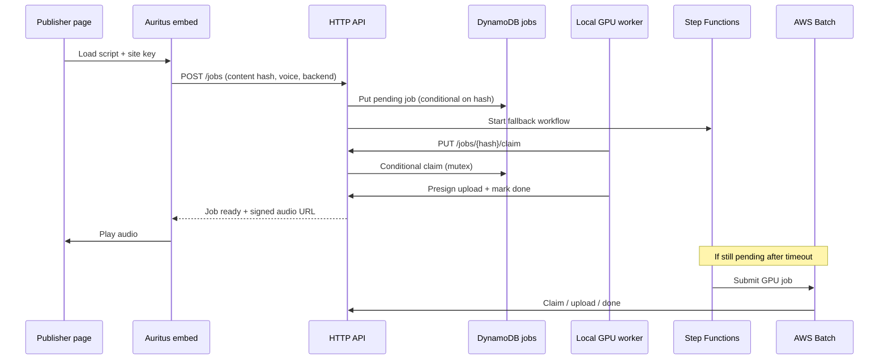

# Auritus architecture

Auritus is a just-in-time TTS pipeline: the browser embed hashes page content,
the API stores jobs behind a mutex, operators' local GPU workers race to claim
work, and AWS Batch runs only when nobody claims in time.

## Components

| Layer | Responsibility |
| --- | --- |
| `embed/` | DOM extraction, ignore rules, content hash, player UI |
| API (Lambda router) | Job CRUD, site keys, quotas, presigned audio URLs |
| DynamoDB | Job mutex state, site registry |
| Local worker (`auritus worker`) | Claim, synthesize, upload audio |
| Step Functions + Batch | Wait for local claim window, then GPU fallback |
| Cognito + Google | Operator CLI authentication |
| S3 + CloudFront | Private audio objects, short-lived signed playback URLs |

## Request flow

## DynamoDB job mutex

- Partition key: `content_hash` (deduplication).
- Status lifecycle: `pending` → `claimed` → `done` (or error paths).
- Claim uses a conditional update: only one owner while
  `claim_deadline` is in the future; expired claims may be stolen.
- GSI on `status` + `created_at` supports worker polling (`/jobs/claimable`).

## Local worker race vs Batch fallback

- When a job is created, Step Functions waits `FALLBACK_SECONDS` (default 15
  minutes).
- After the wait, the state machine reads the job; if still `pending`, it
  submits an AWS Batch GPU task with the content hash and job token.
- A local worker that claims first completes upload and marks `done`, so Batch
  work becomes a no-op or loses the claim race.

## Site keys and embed auth

- Each publisher origin is registered with `auritus site create`.
- The embed sends `X-Auritus-Site-Key` on job and playback requests.
- The router validates the key against the `AuritusSites` table (origin binding,
  quotas). Site keys are not Cognito JWTs; they are deployer-issued capabilities
  scoped to a hostname.

## Operator auth (Cognito + Google)

- CDK provisions a Cognito user pool with Google as an external IdP (client
  id/secret in Secrets Manager).
- `auritus login` runs OAuth authorization code + PKCE on loopback and stores
  short-lived tokens in the OS keyring (file fallback).
- Operator routes (`/sites`, claimable listing, kill switch) require
  `Authorization: Bearer` JWT validated by a Lambda authorizer.

## Audio delivery

- Generated audio lands in a private S3 bucket.
- The API returns CloudFront signed URLs (or presigned S3 URLs) scoped to the
  requesting site key and origin; objects are never world-readable by default.

## Spend guardrails

- AWS Budgets + SNS + EventBridge can disable the Batch queue when daily spend
  crosses a threshold.
- Per-site daily quotas are enforced in the router Lambda.
- `auritus killswitch disable` gives operators a manual stop.

## Related docs

- [SELF_HOSTING.md](SELF_HOSTING.md) — deploy and login on your AWS account
- [MODEL_LICENSES.md](MODEL_LICENSES.md) — TTS weight licensing notes
- [DNS.md](DNS.md) — `aurit.us` Route 53 and Amplify
