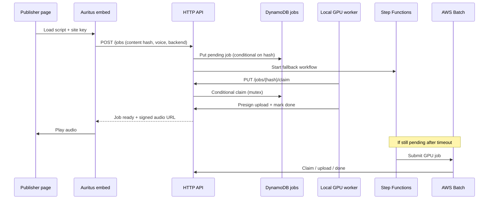
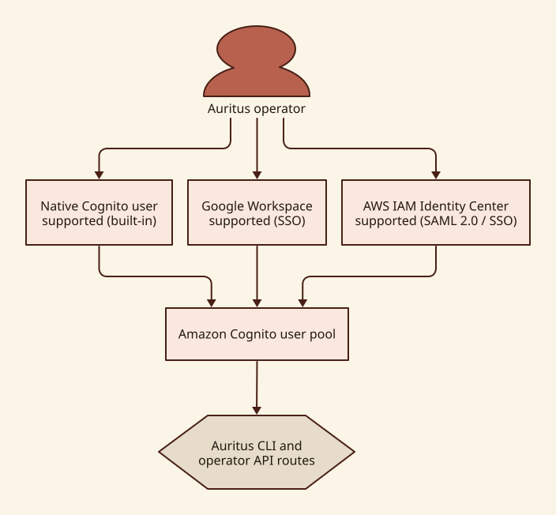

# Auritus architecture

Auritus is a just-in-time TTS pipeline: the browser embed hashes page content,
the API stores jobs behind a mutex, operators' local GPU workers race to claim
work, and AWS Batch runs only when nobody claims in time.

## Why this architecture

Auritus keeps the three choices that a hosted TTS product usually makes for you
in the operator's hands:

- **Data location:** page text is handled by the infrastructure you operate.
  The generated audio is private by default.
- **Model choice:** the worker backend is pluggable, so a team can choose an
  open model and tune its quality, voice, and cost tradeoffs.
- **Compute cost and resilience:** a worker on your own GPU can synthesize the
  routine work. AWS Batch is available when local hardware does not claim the
  job in time.

## AWS deployment

The local worker and the Batch worker use the same job-claim rules. That means
the cloud path does not duplicate work simply because a local GPU is slow: only
the worker that wins the conditional claim may complete the job.

## Components

| Layer | Responsibility |
| --- | --- |
| `embed/` | DOM extraction, ignore rules, content hash, player UI |
| API (Lambda router) | Job CRUD, site keys, quotas, presigned audio URLs |
| DynamoDB | Job mutex state, site registry |
| Local worker (`auritus worker`) | Claim, synthesize, upload audio |
| Step Functions + Batch | Wait for local claim window, then GPU fallback |
| Cognito | Operator CLI authentication (password auth; optional Google IdP) |
| S3 + CloudFront | Private audio objects, short-lived signed playback URLs |

## Request flow

## DynamoDB job mutex

- Partition key: `content_hash` (deduplication).
- Status lifecycle: `pending` → `claimed` → `done` (or error paths).
- Claim uses a conditional update: only one owner while
  `claim_deadline` is in the future; expired claims may be stolen.
- GSI on `status` + `created_at` supports worker polling (`/jobs/claimable`).

## Local worker race vs Batch fallback

- When a job is created, Step Functions waits `FALLBACK_SECONDS` (default 15
  minutes).
- After the wait, the state machine reads the job; if still `pending`, it
  submits an AWS Batch GPU task with the content hash and job token.
- A local worker that claims first completes upload and marks `done`, so Batch
  work becomes a no-op or loses the claim race.

## Site keys and embed auth

- Publisher-origin registration and enforcement are planned secure-by-design
  work; the current site-creation path does not persist an origin binding.
- The embed sends `X-Auritus-Site-Key` on job and playback requests.
- The router currently validates the key against the `AuritusSites` table and
  enforces quotas. Runtime origin registration and enforcement are planned work,
  not completed controls. Site keys are not Cognito JWTs; they are deployer-
  issued capabilities.

## Operator identity choices

- **Native Cognito user — supported (built-in):** CDK provisions a user pool and app
  client. `auritus login --username <email>` uses the native pool's
  `USER_PASSWORD_AUTH` flow. Ideal when you want to keep everything self-contained
  inside your AWS account.
- **Google Workspace via Cognito — supported (SSO):** the stack configures Google
  OIDC federation on the user pool. Operators authenticate via Google single sign-on
  in the web console or via `auritus login --sso google`.
- **AWS IAM Identity Center (AWS SSO) — supported (SAML 2.0 / SSO):** the user pool
  supports SAML 2.0 federation with AWS IAM Identity Center or corporate identity
  providers (Okta, Entra ID, Ping). Operators sign in via single sign-on in the web
  console or via `auritus login --sso aws-sso`.

For the supported CLI path, short-lived JWTs are stored locally under
`~/.auritus/credentials` with mode `0600`. Operator routes (`/sites`, claimable
listing, kill switch) accept an `Authorization: Bearer` JWT. The current Lambda
authorizer does not yet verify JWT signatures or expiry, so production-grade
token validation remains required security work.

## Secure-by-design status

The system is intentionally structured around private audio, short-lived
delivery URLs, conditional job claims, and spending limits. Origin enforcement
and production-grade operator JWT validation are not complete today. The full
secure-by-design architecture and control evidence are still under development.
This document describes current behavior, not a completed security assurance
package. Future security material belongs in a dedicated section that identifies
each control's threat, owner, implementation evidence, and review status.

### Planned security documentation structure

| Section | What it will establish |
| --- | --- |
| Trust boundaries | What crosses from publisher, local worker, and AWS account. |
| Identities and authorization | Operator, site-key, worker, and deployment permissions. |
| Data handling | Text, audio, metadata, retention, and deletion behavior. |
| Control evidence | CDK, tests, logging, and review evidence for each claim. |
- `auritus login --username <email>` calls Cognito `USER_PASSWORD_AUTH` and
  stores short-lived JWTs in `~/.auritus/credentials` (mode 0600).
- Operator routes (`/sites`, claimable listing, kill switch) require
  `Authorization: Bearer` JWT validated by a Lambda authorizer.

## Audio delivery

- Generated audio lands in a private S3 bucket.
- The API returns CloudFront signed URLs (or presigned S3 URLs) scoped to the
  requesting site key and origin; objects are never world-readable by default.

## Spend guardrails

- AWS Budgets + SNS + EventBridge can disable the Batch queue when daily spend
  crosses a threshold.
- Per-site daily quotas are enforced in the router Lambda.
- `auritus killswitch disable` gives operators a manual stop.

## Related docs

- [SELF_HOSTING.md](SELF_HOSTING.md) — deploy and login on your AWS account
- [MODEL_LICENSES.md](MODEL_LICENSES.md) — TTS weight licensing notes
- [DNS.md](DNS.md) — `aurit.us` Route 53 and Amplify
